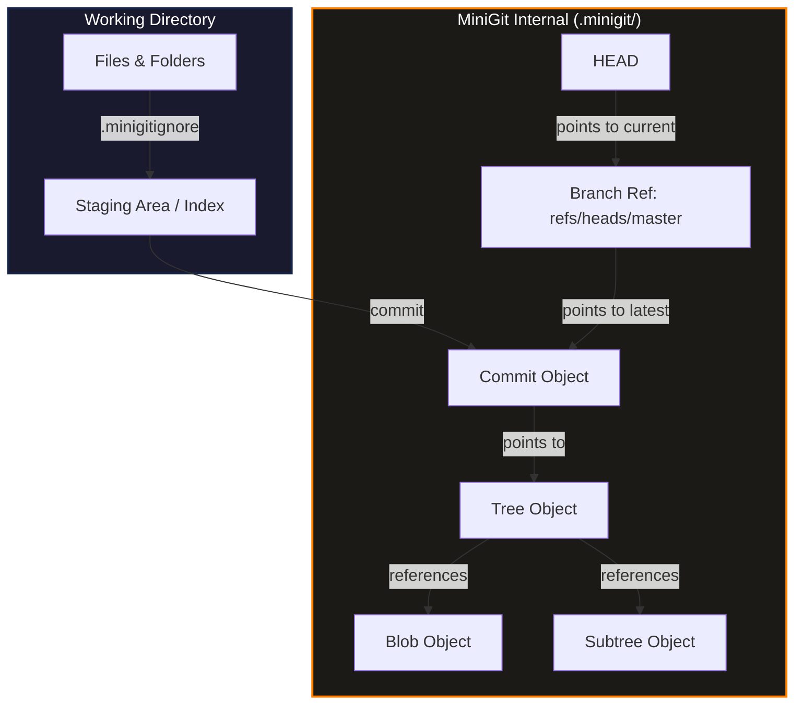

# Building Git From Scratch: A Step-by-Step Guide to MiniGit

Have you ever wondered how Git works under the hood? While it might seem like black magic, Git is actually a beautiful, simple, and elegant content-addressable storage system coupled with a reference tracker. 

In this blog post, we are going to build a fully functional, simplified clone of Git from scratch in Python, which we will call **MiniGit**. 

By the end of this guide, you will understand:
* How Git stores files as **Blobs**, directories as **Trees**, and snapshots as **Commits**.
* How the **Index** (staging area) bridges your working directory and your repository.
* How **Branches** are just tiny files containing a single SHA-1 hash.
* How **Checkout** restores your directory to previous states.
* How **Garbage Collection** sweeps away orphaned files.

Let's dive in!

---

## The Big Picture Architecture

At its core, Git is a directed acyclic graph (DAG) of objects stored on disk. Here is how our MiniGit architecture is laid out:



Each component has a specific responsibility:
1. **Objects (`Blob`, `Tree`, `Commit`)**: Define data structures and binary representations.
2. **Object Store**: Manages writing and reading compressed files under `.minigit/objects/`.
3. **Index Manager**: Manages the list of files staged to be committed.
4. **Branch Manager**: Manages refs, branch pointers, checkout, and tree construction/restoration.
5. **Repository (Facade)**: Orchestrates the commands.
6. **CLI**: Exposes commands via the command-line interface.

---

## Task 1: Repository Initialization (`init`)
The journey begins by initializing the workspace. When you run `git init`, Git creates a hidden directory (usually `.git`) to store its configuration, object databases, and reference logs.

### Feature
An initialization command that sets up the internal database folder structure.

### Steps to Build
1. **Define the Directory Structure**: We need a main storage directory `.minigit/` containing:
   * `objects/`: The database holding all compressed blobs, trees, and commits.
   * `refs/heads/`: Files representing local branches (each file containing the commit hash it points to).
   * `hooks/`, `info/`, `logs/`: Directory placeholders (for Git compatibility).
2. **Setup the HEAD Pointer**: Create a file named `HEAD` at the root of `.minigit/` containing the string `ref: refs/heads/master\n`. This indicates that the active branch is `master`.
3. **Initialize the Staging Area**: Create an empty index file.

### Python Implementation Sketch
```python
import os
from pathlib import Path

class Repository:
    def __init__(self, path="."):
        self.path = Path(path).resolve()
        self.git_dir = self.path / ".minigit"
        self.objects_dir = self.git_dir / "objects"
        self.heads_dir = self.git_dir / "refs" / "heads"
        self.head_file = self.git_dir / "HEAD"
        self.index_file = self.git_dir / "index"

    def init(self) -> bool:
        if self.git_dir.exists():
            print("Repository already exists")
            return False
        
        # Create directories
        for d in [self.objects_dir, self.heads_dir]:
            d.mkdir(parents=True, exist_ok=True)
            
        # Write default HEAD
        self.head_file.write_text("ref: refs/heads/master\n")
        
        # Write empty index
        self.index_file.write_text("{}")
        print(f"Initialized empty MiniGit repository in {self.git_dir}")
        return True
```

---

## Task 2: The Canonical Git Object Model
Git stores everything inside its object database. There are three primary object types you must understand:
1. **Blob**: Stores raw file contents (no metadata like filename or permissions).
2. **Tree**: Stores directory structures. It maps names and modes to other Blobs and Trees (subdirectories).
3. **Commit**: Stores metadata about a snapshot, including author, date, message, parent commits, and a reference to a root Tree object.

All objects in Git share a unified serialization format:

```math
compressed\_data =
\operatorname{zlib}(type + " " + size + "\\0" + content)
```


### Feature
A set of data classes representing Blobs, Trees, and Commits with serialization/deserialization logic.

### Steps to Build
1. **Base Object Class**:
   * Implement a base class `MiniGitObject` that takes a `type` string (e.g., `"blob"`, `"tree"`, `"commit"`) and `content` bytes.
   * Add a `hash()` method that computes the SHA-1 hexadecimal digest of the canonical bytes: `b"{type} {size}\0{content}"`.
   * Add a `serialize()` method that compresses the canonical bytes using python's `zlib`.
   * Add a `deserialize()` method that decompresses the bytes, parses the header, and yields a generic object.
2. **Blob Subclass**: Simply inherits from the base class with type `"blob"`.
3. **Tree Subclass**:
   * A Tree holds a list of entries: `(mode, name, sha1_hex)`.
   * Sort entries by name (canonical Git sorting).
   * Serialize each entry to binary: `b"{mode} {name}\0{20_bytes_raw_sha1}"`.
   * Implement a parser `from_content` to unpack these binary entries back into objects.
4. **Commit Subclass**:
   * Format commit metadata into a readable text block:
     ```text
     tree {tree_sha1}
     parent {parent_sha1} (optional)
     author {name} <{email}> {timestamp} +0000
     committer {name} <{email}> {timestamp} +0000

     {message}
     ```
   * Parse this format back using string operations inside `from_content`.

### Python Implementation Sketch
```python
import hashlib
import zlib
import time

class MiniGitObject:
    def __init__(self, obj_type: str, content: bytes):
        self.type = obj_type
        self.content = content

    def hash(self) -> str:
        header = f"{self.type} {len(self.content)}\0".encode()
        return hashlib.sha1(header + self.content).hexdigest()

    def serialize(self) -> bytes:
        header = f"{self.type} {len(self.content)}\0".encode()
        return zlib.compress(header + self.content)

    @classmethod
    def deserialize(cls, data: bytes) -> 'MiniGitObject':
        decompressed = zlib.decompress(data)
        null_idx = decompressed.find(b"\0")
        header = decompressed[:null_idx]
        content = decompressed[null_idx + 1:]
        obj_type, _size = header.split(b" ", 1)
        return cls(obj_type.decode(), content)

class Blob(MiniGitObject):
    def __init__(self, content: bytes):
        super().__init__("blob", content)

class Tree(MiniGitObject):
    def __init__(self, entries=None):
        self.entries = entries or [] # list of (mode, name, hex_hash)
        super().__init__("tree", self._serialize_entries())

    def _serialize_entries(self) -> bytes:
        content = b""
        for mode, name, obj_hash in sorted(self.entries):
            content += f"{mode} {name}\0".encode()
            content += bytes.fromhex(obj_hash)
        return content

    @classmethod
    def from_content(cls, content: bytes) -> 'Tree':
        tree = cls()
        i = 0
        while i < len(content):
            null_idx = content.find(b"\0", i)
            if null_idx == -1: break
            mode_name = content[i:null_idx].decode()
            mode, name = mode_name.split(" ", 1)
            obj_hash = content[null_idx + 1 : null_idx + 21].hex()
            tree.entries.append((mode, name, obj_hash))
            i = null_idx + 21
        return tree
```

---

## Task 3: The Object Store
How does Git write these files to disk? To keep directories fast and avoid OS limitations on having thousands of files in a single folder, Git uses a sharding strategy:
* If an object's SHA-1 hash is `2e584f...`, Git saves it in `.git/objects/2e/584f...`.
* The first two characters of the hex string become the folder name, and the remaining 38 characters become the filename.

### Feature
An `ObjectStore` class to encapsulate file read/write operations against the `.minigit/objects/` folder.

### Steps to Build
1. **Implement `store(obj)`**:
   * Compute the object's SHA-1 hash.
   * Split the hash into a 2-character prefix and a 38-character suffix.
   * Create the subdirectory under `.minigit/objects/<prefix>/`.
   * Write the serialized (compressed) bytes to the file named `<suffix>`.
2. **Implement `load(hash)`**:
   * Build the path using the shard structure.
   * Read the compressed bytes from disk, decompress, and return the `MiniGitObject`.
3. **Implement `exists(hash)`**: Helper to check if a file exists.

### Python Implementation Sketch
```python
class ObjectStore:
    def __init__(self, objects_dir: Path):
        self.objects_dir = objects_dir

    def store(self, obj: MiniGitObject) -> str:
        obj_hash = obj.hash()
        obj_dir = self.objects_dir / obj_hash[:2]
        obj_file = obj_dir / obj_hash[2:]

        obj_dir.mkdir(parents=True, exist_ok=True)
        if not obj_file.exists():
            obj_file.write_bytes(obj.serialize())
        return obj_hash

    def load(self, obj_hash: str) -> MiniGitObject:
        obj_file = self.objects_dir / obj_hash[:2] / obj_hash[2:]
        if not obj_file.exists():
            raise FileNotFoundError(f"Object {obj_hash} not found")
        return MiniGitObject.deserialize(obj_file.read_bytes())
```

---

## Task 4: The Staging Area (The Index)
The index (or staging area) is a binary file cache that keeps track of the file modifications you want to include in your next commit. In real Git, it is a binary format with metadata. For **MiniGit**, we will use a **JSON file** mapping relative file paths to blob SHA-1 hashes:
```json
{
  "src/main.py": "2e584f...",
  "README.md": "a8fd21..."
}
```

### Feature
Staging files and folders to prepare for a commit, plus exclusion logic.

### Steps to Build
1. **Ignore Patterns (`.minigitignore`)**:
   * Read ignore patterns from a `.minigitignore` file at the root.
   * Always ignore the internal `.minigit` folder.
   * Use python's `fnmatch` to see if a file or directory matches any exclusion rule.
2. **Staging Files (`add_file`)**:
   * Read file contents and create a `Blob` object.
   * Write the blob to the object store.
   * Load the current index JSON dictionary, append or update `"relative/path": "blob_hash"`, and save it back.
3. **Staging Folders (`add_directory`)**:
   * Recursively search (`rglob("*")`) the directory for files.
   * Skip files matching ignore patterns.
   * Add each file to the index dictionary.

---

## Task 5: Committing Changes (`commit`)
When you commit, you are freezing the staging area into a permanent snapshot.
A commit involves two main operations:
1. Turning the flat index map of files into a nested tree structure and writing it to the database.
2. Generating a commit object referencing this tree and pointing to the parent commit.

### Feature
A commit workflow that builds the directory tree, links parents, and commits.

### Steps to Build
1. **Build a Directory Tree from a Flat Index**:
   * Convert a flat index dictionary like `{"src/utils.py": "shaX", "README.md": "shaY"}` into a nested tree.
   * Sort entries, create sub-trees for directories, and write them to the object store from the bottom up.
   * Return the root tree hash.
2. **Resolve the Parent Commit**:
   * Check the current active branch by reading `.minigit/HEAD`.
   * Read the branch file under `.minigit/refs/heads/<branch>` to find the current commit. This will be the parent of the new commit.
3. **Prevent Empty Commits**:
   * If there is a parent commit, compare the new tree hash with the parent's tree hash. If they are identical, abort (working tree clean).
4. **Save and Advance HEAD**:
   * Instantiate a `Commit` object pointing to the root tree, referencing the parent, setting author details, and a commit message.
   * Store the commit in the object database.
   * Update `.minigit/refs/heads/<branch>` to point to the new commit's hash.

### Visualizing Tree Building:
```text
Index: {"src/a.py": "shaA", "b.py": "shaB"}
              |
              V
Root Tree (points to b.py [Blob shaB] and src/ [Tree shaSrc])
              |
              +---> src/ Tree (points to a.py [Blob shaA])
```

---

## Task 6: Logging and History (`log`)
A commit chain is a singly linked list pointing backwards in time. Every commit contains a `parent_hashes` field that references the commit before it.

```text
Commit C (HEAD)  ----->  Commit B (Parent)  ----->  Commit A (Initial)
```

### Feature
Displaying the commit history of the active branch.

### Steps to Build
1. **Find Start Point**:
   * Check the current active branch from `HEAD`.
   * Get the commit hash pointing to the tip of this branch.
2. **Traverse Backwards**:
   * Loop through commits: Load the commit using the hash, parse it, and print metadata (Author, Date, message).
   * Fetch the parent hash from the commit's `parent_hashes` list.
   * Repeat until a commit has no parent (initial commit) or you hit a limit (e.g. `max_count=10`).

---

## Task 7: Branch Management (`branch`)
What is a branch? Unlike other VCS tools that duplicate files, a Git branch is simply a text file containing a 40-character SHA-1 commit hash.

```text
.minigit/refs/heads/master      --> contains "c4a93f..."
.minigit/refs/heads/feature-1   --> contains "c4a93f..."
```

### Feature
List, create, or delete branches.

### Steps to Build
1. **List Branches**:
   * Read files inside `.minigit/refs/heads/`.
   * Mark the active branch (obtained from `HEAD`) with an asterisk `*`.
2. **Create Branch**:
   * Read the commit hash of the current active branch.
   * Write this hash into a new file named `.minigit/refs/heads/<new_branch_name>`.
3. **Delete Branch**:
   * Remove the file named `.minigit/refs/heads/<branch_name>`.

---

## Task 8: Checking Out Branches (`checkout`)
Checking out a branch means updating your working files to match the snapshot stored in that branch's latest commit.

### Feature
Switching branches and updating the working directory.

### Steps to Build
1. **Determine What to Clear**:
   * Load the current branch's latest commit and read its tree.
   * Recursively collect all files tracked in this tree. These files must be deleted from the working directory so they don't leak into the checked-out branch.
2. **Restore Files from the Target Branch**:
   * Read the target branch file to get its latest commit.
   * Retrieve the root tree from this commit.
   * Recursively restore files and directories to the working directory.
3. **Update Staging**:
   * Reconstruct the index mapping from the checked-out tree.
   * Write this mapping into `.minigit/index`.
4. **Point HEAD to Target Branch**:
   * Overwrite `.minigit/HEAD` with `ref: refs/heads/<target_branch>`.

---

## Task 9: Working Tree Status and Diffing (`status` & `diff`)
These operations compare state across three domains:
* **HEAD (Last Commit)**
* **Index (Staged)**
* **Working Directory**

```text
   [ HEAD Commit ]
         |
         |  Compare (Staged changes)
         V
    [ The Index ]
         |
         |  Compare (Unstaged changes)
         V
[ Working Directory ]
```

### Feature
Checking what files have been modified, staged, or remain untracked, and displaying lines changed.

### Steps to Build
1. **Compare Index and HEAD**:
   * List files in the index and the latest commit tree.
   * Files in the index but not HEAD: `new file`.
   * Files in both but with different hashes: `modified`.
   * Files in HEAD but not the index: `deleted`.
   * Display these as **"Changes to be committed"**.
2. **Compare Working Directory and Index**:
   * Scan files currently in the working directory (excluding ignored ones) and calculate their hashes on the fly.
   * Files in working directory but not index/HEAD: `untracked`.
   * Files in index but missing from working directory: `deleted`.
   * Files with different hashes: `modified`.
   * Display these as **"Changes not staged for commit"**.
3. **Show Differences (`diff`)**:
   * For files with unstaged changes, load the staged version from the index (via its hash in the object store) and read the file on disk.
   * Use python's `difflib.unified_diff()` to output a line-by-line diff.

---

## Task 10: Garbage Collection (`gc`)
Whenever you checkout files or overwrite commits (e.g. amending), some objects in the database become "orphans." Nothing points to them anymore.

### Feature
Pruning loose, unreachable objects from the `.minigit/objects/` folder.

### Steps to Build
1. **Collect Reachable Objects**:
   * Loop through all files in `.minigit/refs/heads/` to get branch tips.
   * For each branch tip, traverse back through parent commits.
   * For each commit, traverse its root Tree recursively to collect all child Tree and Blob hashes.
   * Include hashes currently listed in the staging Index.
2. **List All Stored Hashes**: Scan the `.minigit/objects/` directories to get all files.
3. **Prune Unreachable Files**:
   * Compare the stored hashes against the reachable hashes.
   * Delete files from disk that are not in the reachable set. Clean up empty parent prefix folders.

---

## Task 11: The CLI Interface
Finally, wrap these components into a command line interface using Python's built-in `argparse`.

### Feature
Command-line parser mapping console flags to Repository methods.

### Steps to Build
1. **Setup Argument Parser**: Create a subparser mapping commands: `init`, `add`, `commit`, `status`, `diff`, `log`, `branch`, `checkout`, `gc`.
2. **Guard Repository Methods**: Implement a validation helper ensuring a `.minigit` folder exists before running commands other than `init`.
3. **Map Args**: Route `args` to `Repository` methods:
   * `minigit add <file>` $\to$ `repo.add_path(file)`
   * `minigit commit -m "msg"` $\to$ `repo.commit(msg)`
   * `minigit checkout <branch>` $\to$ `repo.checkout(branch)`

---

## Verification: Trying it out!

You can run MiniGit commands directly after setting up the scripts:

```bash
# Initialize repository
python main.py init

# Stage files
python main.py add src/ README.md

# Commit
python main.py commit -m "Initial commit"

# Check status
python main.py status

# Switch to a new branch
python main.py checkout -b feature-test
```

Building a VCS system from scratch is a fantastic exercise. It strips away the complexity of network transfer and packfile optimization, revealing the elegant data structure at the heart of Git. Now that you know how it works, you can write better code, debug merge conflicts with ease, and respect the masterfully simple design behind version control.
